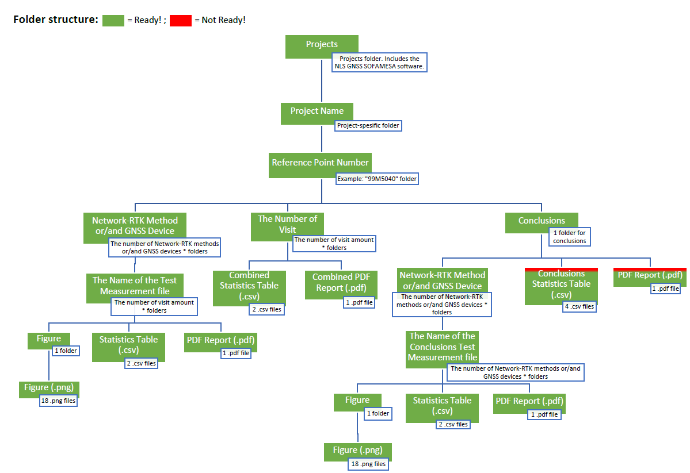

# NLS GNSS SOFAMESA
*Do you ever compare the performance of different GNSS receivers or Network-RTK methods (VRS, PRS, MAC, MAX, i-MAX, FKP etc.) before investing into one? How do you validate the performance of a GNSS receiver or a Network-RTK method in reality? You can use this software for those purposes.*

### GNSS Measurement Accuracy Analysis Software of the National Land Survey of Finland
* Author: Tuukka Mattila. Don't hesitate to contact via LinkedIn: [LinkedIn profile](https://www.linkedin.com/in/tuukkamattila/)
* Thank you for the help: Topi Rikkinen, Marko Ollikainen, Antti Laaksonen, Hannu Koivula, Octavian Andrei, Mikael Kauhava, Timo Sallinen and Ari Huvinen.

**Capabilities**

*  Watch [a video of the National Land Survey of Finland](https://www.youtube.com/watch?v=urj7mGjKY9Q)
*  Import your own [GNSS measurements files (.txt or .csv)](20190524-A-90M9180-METHOD1-1.txt)
*  Import your own [GNSS reference points coordinates file (.txt or .csv)](reference_points.txt)
*  Set your own tolerance values for horizontal and vertical outlier recognition
*  Visual outlier recognition based on the Kernel Density Estimator (KDE) plots of the distributions of errors
*  Calculate the means, medians and standard deviations of the North and East coordinates and Heights
*  The GNSS measurement data can be fitted to follow the Gaussian distribution. You can produce Gaussian distribution models with the help of the means and standard deviations of the GNSS measurements. Utilize random number generation to produce the models and calculate distributions. You can test the models with varying sample sizes.
*  Calculate inner accuracies (precisions)
*  Calculate outer accuracies (accuracies)
*  Produce [Measurement report](20190524-A-90M9180-METHOD1-1_Measurement_Report.pdf) .pdf file of the figures and statistics of the GNSS measurements.
*  Produce two statistics tables [Table 1](20190524-A-90M9180-METHOD1-1_table1.csv) and [Table 2](20190524-A-90M9180-METHOD1-1_table2.csv) of the GNSS measurements.
*  Produce [Combined measurement report](90M9180_1_Combined_Measurement_Report.pdf) .pdf file of the figures and statistics of the GNSS measurements.
*  Produce combined statistics tables [Table 1](90M9180_1_Combined_Statistics_Table1.csv) and [Table 2](90M9180_1_Combined_Statistics_Table2.csv) of the GNSS measurements.
*  Produce [Conclusions of the measurement reports](90M9180_10_Visits_Conclusions_Measurement_Report.pdf) .pdf file of the figures and statistics of the GNSS measurements. You can define your own tolerance values for parameter grading and their weighing. Receive a ranking of the different GNSS receivers and Network-RTK methods.
*  Produce conclusions statistics tables [Table 1](90M9180_10_Visits_Conclusions_Statistics_Table1.csv), [Table 2](90M9180_10_Visits_Conclusions_Statistics_Table2.csv), [Table 3](90M9180_10_Visits_Conclusions_Statistics_Table3.csv) and [Table 4](90M9180_10_Visits_Conclusions_Statistics_Table4.csv) of the GNSS measurements.

**Analysis of**

*  Solution Percentages (Fixed; Float; Code Diff; Standalone; Other)
*  The Number of Satellites (GPS, GLONASS, GALILEO, BEIDOU)
*  The DOP Values: HDOP, VDOP, PDOP, TDOP, GDOP
*  The Reported HRMS and VRMS Values of the Receiver
*  The outlier recognition
*  The means, medians and standard deviations of the North and East coordinates and Heights
*  The inner accuracies (precisions): Horizontal RMSE and 2dRMSE, Vertical RMSE and 2dRMSE, North precisions, East precisions, Vertical precisions, Horizontal precisions, Horizontal precisions with DOP values, 3D precisions with DOP values, Vertical precisions with DOP values
*  The outer accuracies (accuracies): Horizontal RMSE and 2dRMSE, Vertical RMSE and 2dRMSE, North accuracies, East accuracies, Vertical accuracies, Horizontal accuracies
*  The Performance of different GNSS receivers or Network-RTK methods concluded in a Grading Table: [Table 4](90M9180_10_Visits_Conclusions_Statistics_Table4.csv)
*  The Time Spent (s) of the Program

**Output figures (.png)**

*  A_The Number of Satellites (No Outliers or Float Solutions Removed)
*  B_The DOP Values (No Outliers or Float Solutions Removed)
*  C_The Reported HRMS and VRMS Values of the Receiver  (No Outliers or Float Solutions Removed)
*  D_The Solutions (No Outliers Removed)
*  E_KDE Plot for Outlier Recognition (PRECISION, INNER ACCURACY)
*  F_KDE Plot for the Distribution of Errors (PRECISION, INNER ACCURACY)
*  G_Gaussian Distribution Models for the Distributions of Errors (PRECISION, INNER ACCURACY)
*  H_The PRECISION of the point (INNER accuracy) (m) HORIZONTAL
*  I_The PRECISION of the point (INNER accuracy) (m) NORTH
*  J_The PRECISION of the point (INNER accuracy) (m) EAST
*  K_The PRECISION of the point (INNER accuracy) (m) VERTICAL
*  L_The ACCURACY of the point (OUTER accuracy) (m) HORIZONTAL
*  M_The ACCURACY of the point (OUTER accuracy) (m) NORTH
*  N_The ACCURACY of the point (OUTER accuracy) (m) EAST
*  O_The ACCURACY of the point (OUTER accuracy) (m) VERTICAL
*  P_The Horizontal PRECISION of the point (INNER accuracy) (m) with DOP values
*  Q_The 3D PRECISION of the point (INNER accuracy) (m) with DOP values
*  R_The Vertical PRECISION of the point (INNER accuracy) (m) with DOP values

**[Measurement report](20190524-A-90M9180-METHOD1-1_Measurement_Report.pdf) .pdf file, [Combined measurement report](90M9180_1_Combined_Measurement_Report.pdf) .pdf file and [Conclusions of the measurement reports](90M9180_10_Visits_Conclusions_Measurement_Report.pdf) .pdf file tables 1 & 2:**

**[Table 1](20190524-A-90M9180-METHOD1-1_table1.csv), [Table 1](90M9180_1_Combined_Statistics_Table1.csv) & [Table 1](90M9180_10_Visits_Conclusions_Statistics_Table1.csv)**

*  Total Number of Measurements (No Outliers Removed)
*  Timespan (No Outliers Removed)
*  Solution Percentages (No Outliers Removed), Fixed; Float; Code Diff; Standalone; Other
*  Number of All Satellites Mean (No Outliers Removed)
*  Number of All Satellites (No Outliers Removed), Min; Max
*  Number of GPS Satellites Mean (No Outliers Removed)
*  Number of GLONASS Satellites Mean (No Outliers Removed)
*  Number of GALILEO Satellites Mean (No Outliers Removed)
*  Number of BEIDOU Satellites Mean (No Outliers Removed)
*  Mean of HDOP Values (No Outliers Removed)
*  Mean of VDOP Values (No Outliers Removed)
*  Mean of PDOP Values (No Outliers Removed)
*  Mean of TDOP Values (No Outliers Removed)
*  Mean of GDOP Values (No Outliers Removed)
*  User-Defined Tolerance Values, North (m) and East (m); Height (m)
*  Number of Measurements Above the Set Tolerance Values
*  Above Tolerance Values Percentage
*  Timespan (Outliers Removed)
*  Solution Percentages (Outliers Removed), Fixed; Float; Code Diff; Standalone; Other
*  Number of All Satellites Mean (Outliers Removed)
*  Number of All Satellites (Outliers Removed), Min; Max
*  Number of GPS Satellites Mean (Outliers Removed)
*  Number of GLONASS Satellites Mean (Outliers Removed)
*  Number of GALILEO Satellites Mean (Outliers Removed)
*  Number of BEIDOU Satellites Mean (Outliers Removed)
*  Mean of HDOP Values (Outliers Removed)
*  Mean of VDOP Values (Outliers Removed)
*  Mean of PDOP Values (Outliers Removed)
*  Mean of TDOP Values (Outliers Removed)
*  Mean of GDOP Values (Outliers Removed)

**[Table 2](20190524-A-90M9180-METHOD1-1_table2.csv), [Table 2](90M9180_1_Combined_Statistics_Table2.csv) & [Table 2](90M9180_10_Visits_Conclusions_Statistics_Table2.csv)**

- Precision
  - Horizontal RMSE ± (m)
  - Vertical RMSE ± (m)
  - Horizontal 2dRMSE ± (m)
  - Vertical 2dRMSE ± (m)
  - North Coordinate Standard Deviation ± (m)
  - East Coordinate Standard Deviation ± (m)
  - Height Standard Deviation ± (m)
  - North Coordinate Mean (m)
  - East Coordinate Mean (m)
  - Height Mean (m)
  - North Coordinate Median (m)
  - East Coordinate Median (m)
  - Height Median (m)
- Accuracy ± (m)
  - Horizontal RMSE
  - Vertical RMSE
  - Horizontal 2dRMSE
  - Vertical 2dRMSE
  
**[Conclusions of the measurement reports](90M9180_10_Visits_Conclusions_Measurement_Report.pdf) .pdf file tables 3 & 4:**

**[Table 3 (Evaluated Parameters & Weighing Percentages Table)](90M9180_10_Visits_Conclusions_Statistics_Table3.csv)**

These are the parameters, which are taken into account in the [Table 4 (Grading Table)](90M9180_10_Visits_Conclusions_Statistics_Table4.csv), in which each of these parameters are weighted based on their importance:
*  Fixed Solutions % (With Outliers)
*  Above Tolerance Values %
*  Fixed Solutions % (No Outliers)
*  Mean of PDOPs
*  Mean of GDOPs
*  Precision: Horizontal RMSE ± (m)
*  Precision: Vertical RMSE ± (m)
*  Accuracy: Horizontal RMSE ± (m)
*  Accuracy: Vertical RMSE ± (m)
*  Precision: North Coordinate Std ± (m)
*  Precision: East Coordinate Std ± (m)
*  Precision: Height Std ± (m)

**[Table 4 (Grading Table)](90M9180_10_Visits_Conclusions_Statistics_Table4.csv)**

*  The Grading Table, in which the maximum amount of points is 5, which is the sum of the weighted points. The highest number of points reveals the winner.

**[Measurement_File_Naming_and_Folder_Structures](Measurement_File_Naming_and_Folder_Structures.pdf)**

**Requirements:**

*  Windows Operating System
*  Free access through firewall
*  The test data should consist of at least 3600 measurements per reference point. Is the requirement met? For example, with 10 seconds measurement time and 1 second epocs, averaged solutions should be 3600 pcs. Does the file consist of at least 3600 measurements for the point?
*  Import the [GNSS measurement data as .txt or .csv file(s)](20190524-A-90M9180-METHOD1-1.txt) and separated with "," and formatted as (the order of the columns doesn't matter) [Point Number,Code,Date,Time,Solution,Physical Station ID,Virtual Station ID,Northing,Easting,Ell Ht,Elev,Ant Ht,HRMS,VRMS,HDOP,VDOP,PDOP,GDOP,TDOP,GPS,GLONASS,GALILEO,BEIDOU,SBAS,QZSS].
*  Import the [GNSS reference points coordinates data as .txt or .csv file](reference_points.txt) and separated with "," and formatted as (the order of the columns doesn't matter) [Reference Point Number,Northing,Easting,Elevation].

## INSTRUCTIONS

*In order to successfully operate the NLS GNSS SOFAMESA, please follow the instructions below.*

### Phases

1.  Download all of the files provided as a .zip file from the Releases page: https://github.com/nlsfi/nls-gnss-sofamesa/releases
2.  Unzip the files to a proper location, where you want to create all of your project files. *If you have your own measurement files and reference point coordinates file, those should all be located in the same folder, in which this software is located.*
3.  Install Anaconda Platform for Windows: https://www.anaconda.com/
4.  Make sure that your firewall doesn't block any of the operations related to the Anaconda platform.
5.  (IN PROGRESS) Install the required libraries, if not defaultly installed. *The ones including the installation url should at least be manually installed*:
*   iPython
*   time
*   [numpy](https://anaconda.org/anaconda/numpy)
*   [matplotlib](https://anaconda.org/anaconda/matplotlib)
*   [pandas](https://anaconda.org/anaconda/pandas)
*   [seaborn](https://anaconda.org/anaconda/seaborn)
*   os
*   sys
*   math
*   [pathlib](https://anaconda.org/anaconda/pathlib)
*   glob
*   re
*   string
*   datetime
*   [reportlab](https://anaconda.org/anaconda/reportlab)
*   [pypdf2](https://anaconda.org/conda-forge/pypdf2)
6.  Launch Anaconda Prompt.
7.  Change the directory to the folder, where the [NLS_GNSS_SOFAMESA_Main_Program.ipynb](NLS_GNSS_SOFAMESA_Main_Program.ipynb) file is located. In Anaconda Prompt, write: *cd [the path here without the brackets]*
8.  Launch Jupyter Notebook. In Anaconda Prompt, write: *jupyter-notebook*
9.  When the browser is launched, select the [NLS_GNSS_SOFAMESA_Main_Program.ipynb](NLS_GNSS_SOFAMESA_Main_Program.ipynb) file from the directory view.
10. Restart the current kernel and re-run the whole notebook (OR run the notebook cell by cell for debugging).
11. Please find the [Measurement_File_Naming_and_Folder_Structures.pdf](Measurement_File_Naming_and_Folder_Structures.pdf) file, which describes the measurement file naming and folder structures.
--------------------------------------------------------------------------------

*Honours:*

>  "...one guy’s noise is the other guy’s signal..." - [Martin Vermeer, Professor of Geodesy, Department of the Built Environment, School of Engineering, Aalto University](https://users.aalto.fi/~mvermeer/) [28th March 2019, Page 115, Methods of Navigation](https://users.aalto.fi/~mvermeer/nav-en.pdf) 

>  "What you see from where you are" not "Where you are from what you see" - Greg Welch & Gary Bishop [28th March 2019, Page 15, An Introduction to the Kalman Filter](http://www.cs.unc.edu/~tracker/media/pdf/SIGGRAPH2001_Slides_08.pdf)

>  "...Like a coffee filter filters coffee from coffee-grounds, the Kalman filter filters the signal (the state vector) from the noise of both the observation and the movement process..." - [Martin Vermeer, Professor of Geodesy, Department of the Built Environment, School of Engineering, Aalto University](https://users.aalto.fi/~mvermeer/) [28th March 2019, Page 31, Methods of Navigation](https://users.aalto.fi/~mvermeer/nav-en.pdf) 

>  "If you don't know, then you can't know" -TR [28th March 2019]
